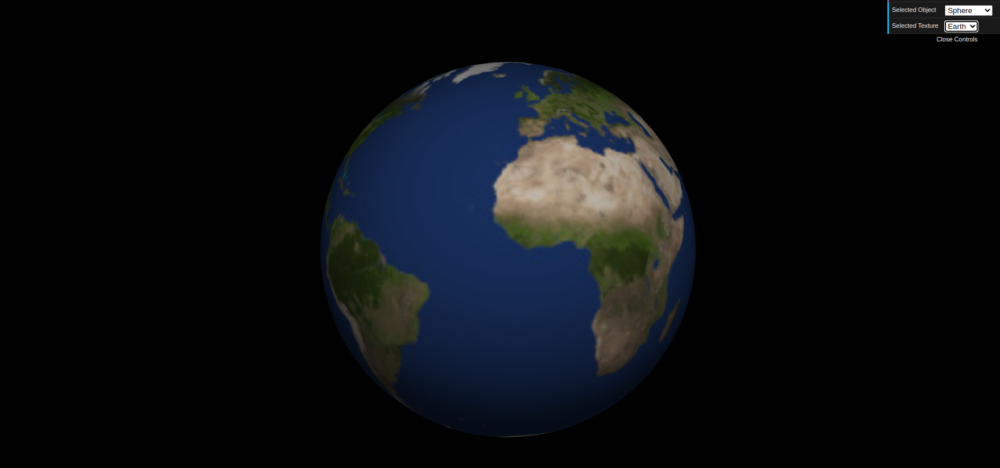
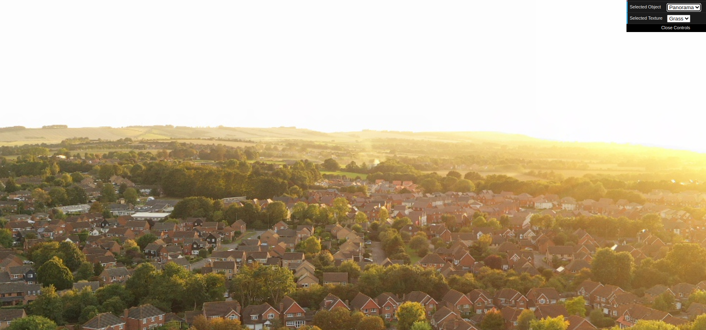
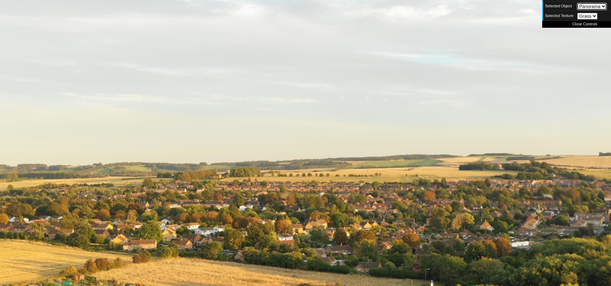
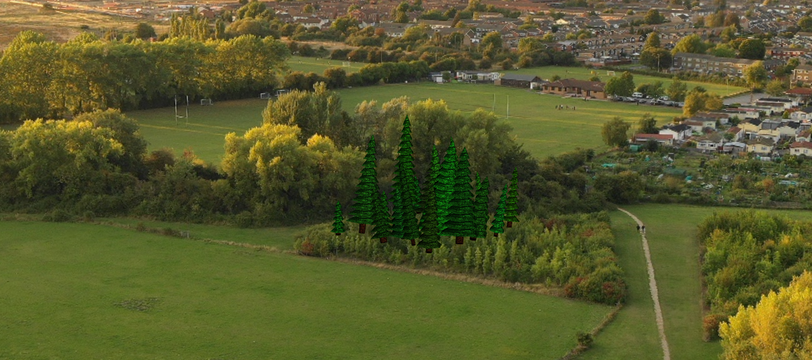
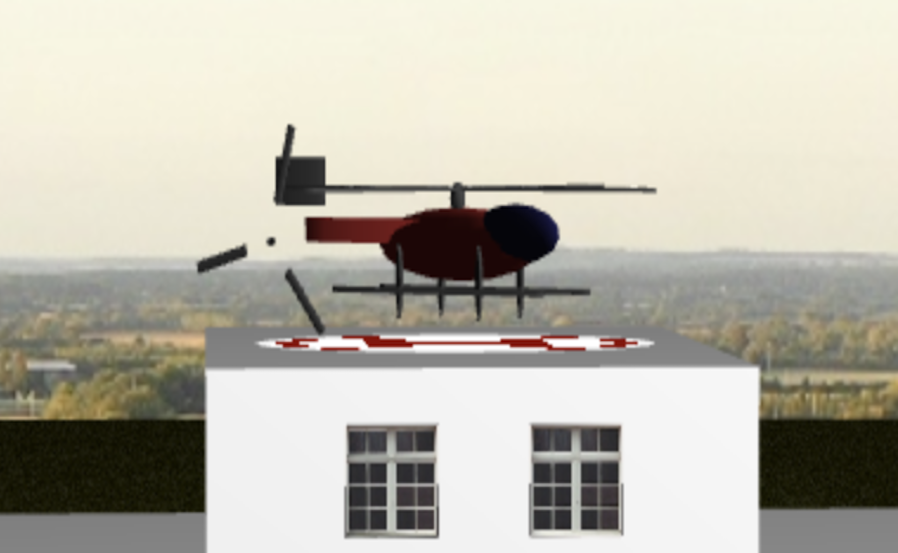
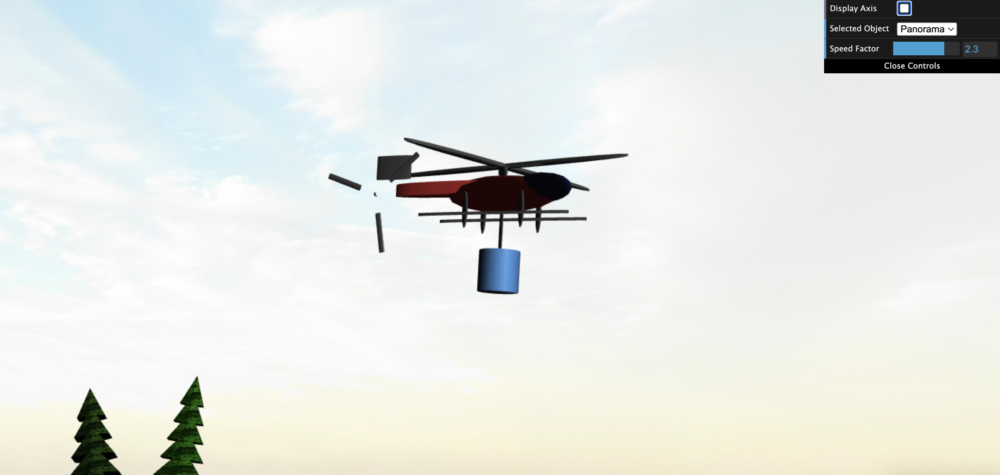
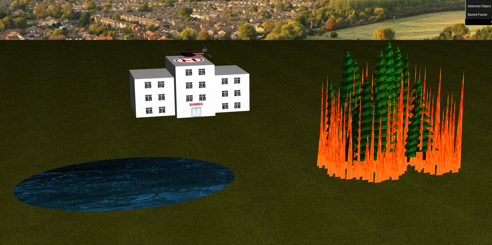
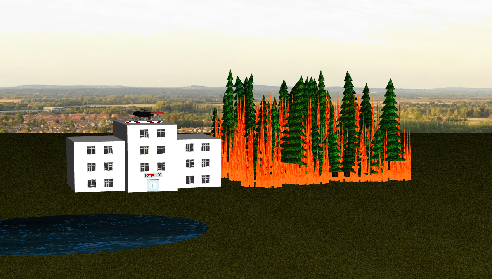
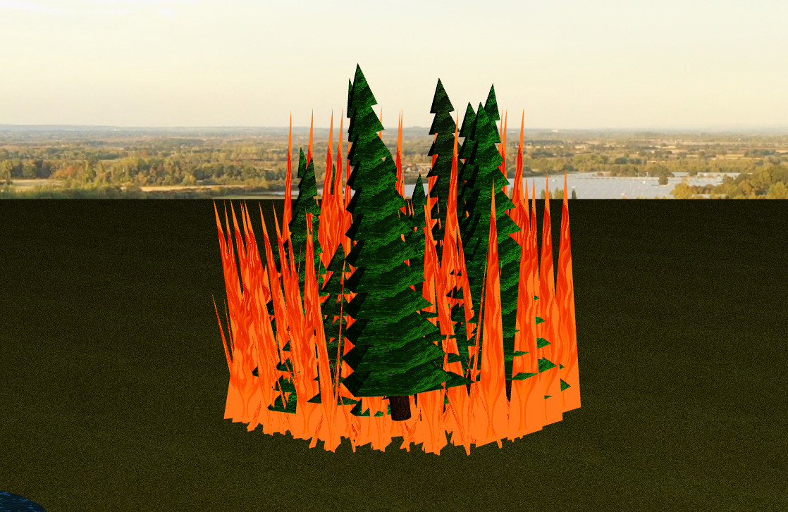

# CG 2024/2025

## Group T12G10

## Project Notes

### Main observations/remarks 

#### 1. Sky-Sphere

###### 1.1. Sphere with earth texture: 

###### 1.2. Panoramas: 

#### 2. Fire-fighters Building

#### 3. Forest with textures 

#### 4. Helicopter

#### 5. Helicopter flying

#### 6. Water and fire

#### 7. Flame ripple

