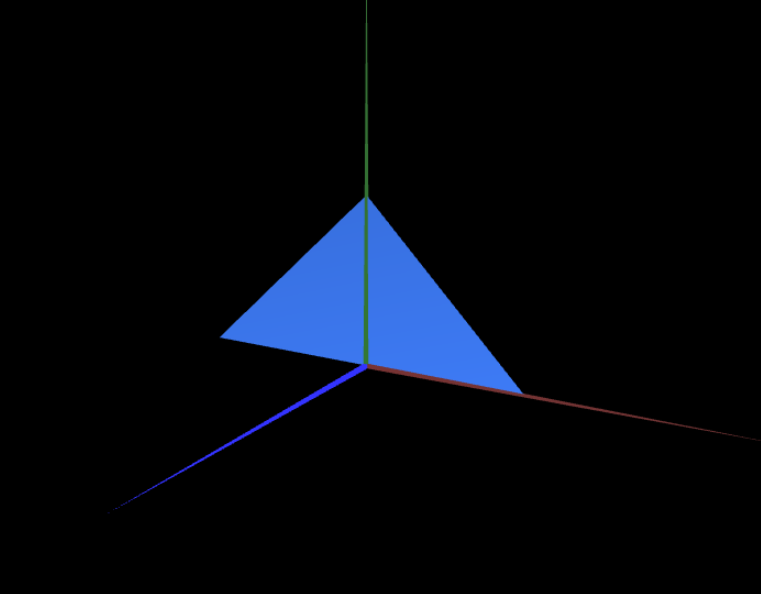

# CG 2024/2025

## Group T12G10

## TP 1 Notes

### Main observations/remarks 
- In the beggining of the exercises, we had some trouble understanding how to make the objects double-sided.
- There were no big difficulties in general.

#### Exercise 1 Screenshots

- MyDiamond: 

- MyTriangle: 

- MyParallelogram: 

#### Exercise 2 Screenshots

- MyTriangleSmall: 

- MyTriangleBig: 

