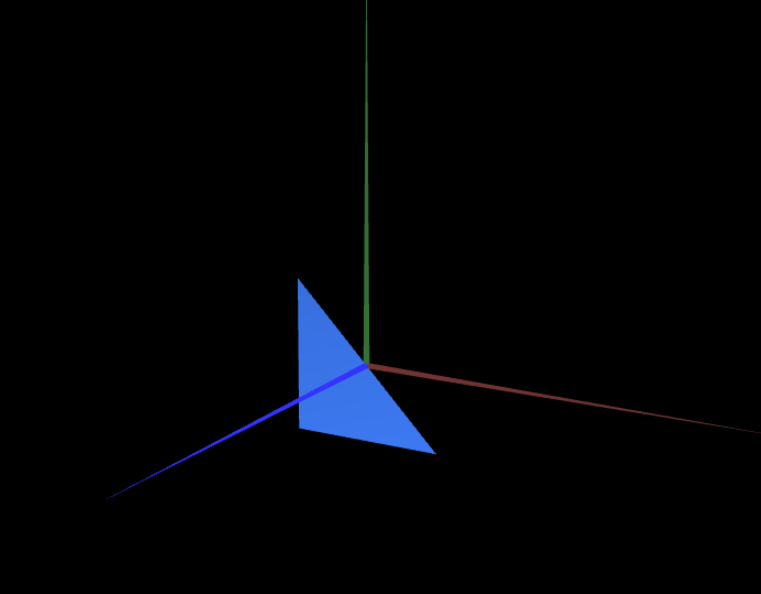
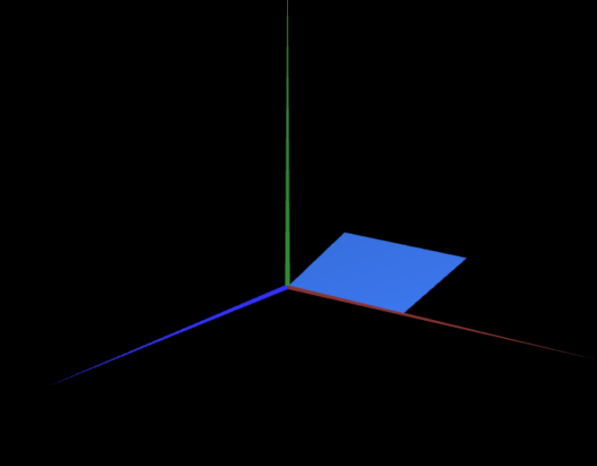
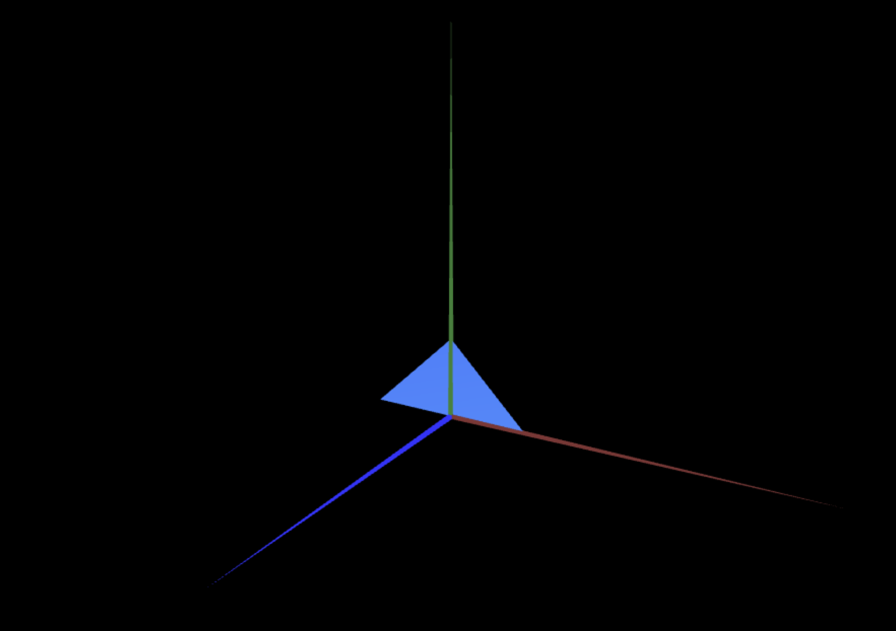

# CG 2024/2025

## Group T12G10

## TP 1 Notes

(add your main observations/remarks about your experiments here, in a bulleted list, and remove this line. Some examples below)

- In exercise 1 we observed X
- In exercise 2 we had difficulties in Y

#### Exercise 1 Screenshots

- MyDiamond: 

- MyTriangle: 

- MyParallelogram: 

#### Exercise 2 Screenshots

- MyTriangleSmall: 

