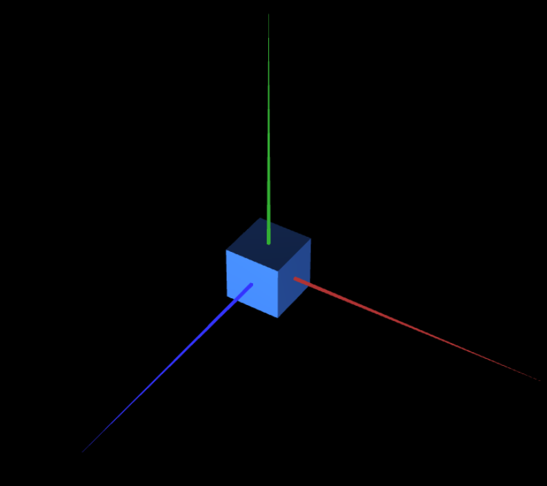
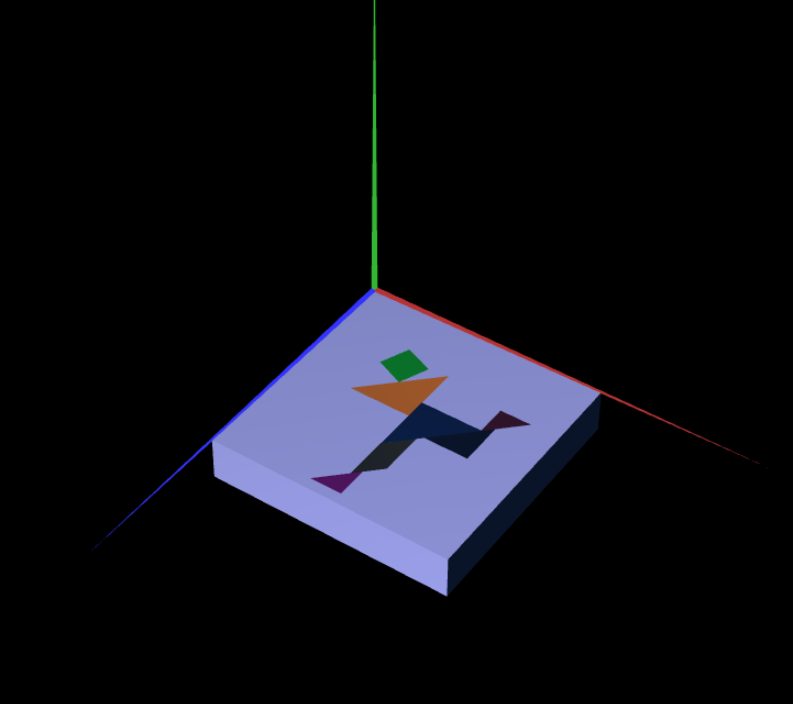

# CG 2024/2025

## Group T12G10

## TP 2 Notes

### Main observations/remarks 
- We had some trouble undestanding how the translation matrix worked for the diamond.
- There were no big difficulties in general.

#### Exercise 2 Screenshots

- Tangram: 

#### Exercise 3 Screenshots

- Tangram with the base:

- Tangram with the base - parallel to the XZ plane:

#### Exercise 4 Screenshots

- Cube composed of planes:

- Cube with the tangram :

