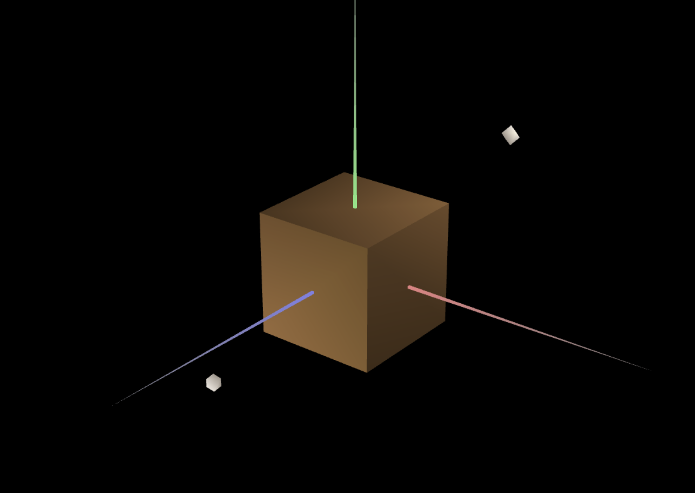

# CG 2024/2025

## Group T12G10

## TP 3 Notes

### Main observations/remarks 
- One difficulty we encountered was correctly assigning normals to each face of the cube, as improper normals caused some faces to not be displayed.
- There were no big difficulties in general.

#### Exercise 1 Screenshots

- Unit cube with the wood material: 

- Tangram with the custom material diamond and  different materials for the other parts:

#### Exercise 2 Screenshots

#### Exercise 3 Screenshots
