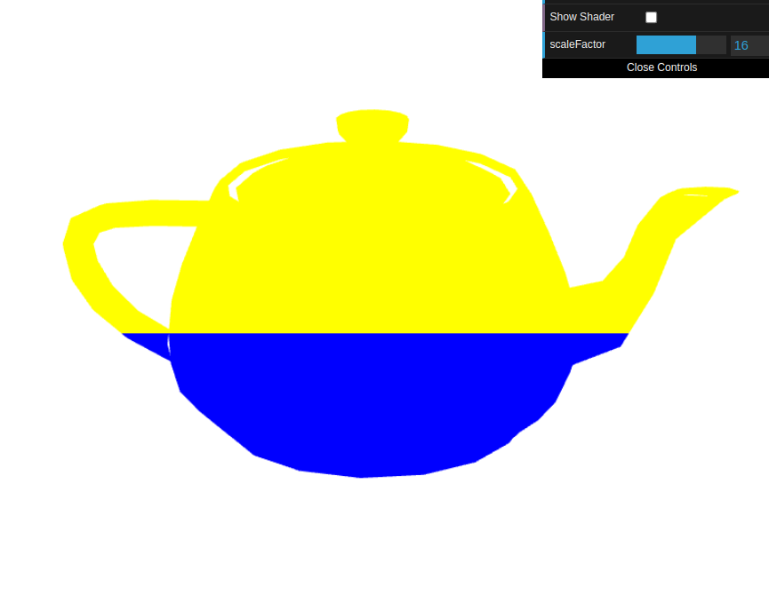
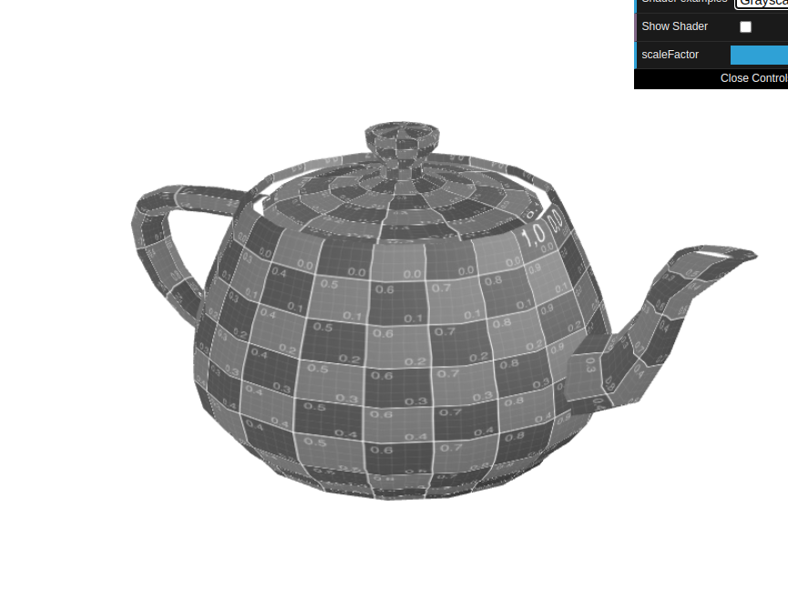

# CG 2024/2025

## Group T12G10

## TP 5 Notes

### Main observations/remarks 
- At first, it took us a while to figure out how the textures coordinates worked.
- Overall, we didn´t have many difficuties in this week's exercises.

#### Exercise 1 Screenshots

- Teapot with the new shaders, changing colors: 

#### Exercise 2 Screenshots

- Cube with textures: 

